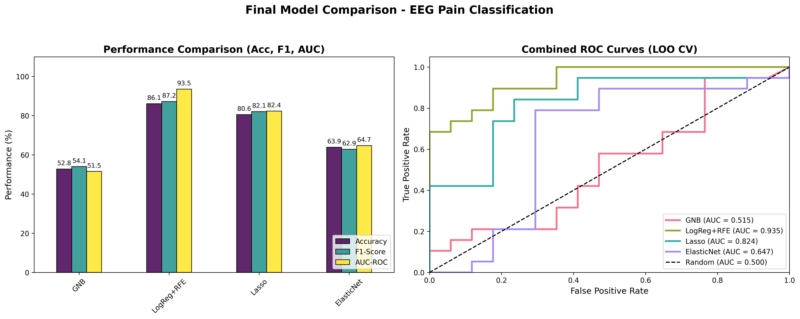
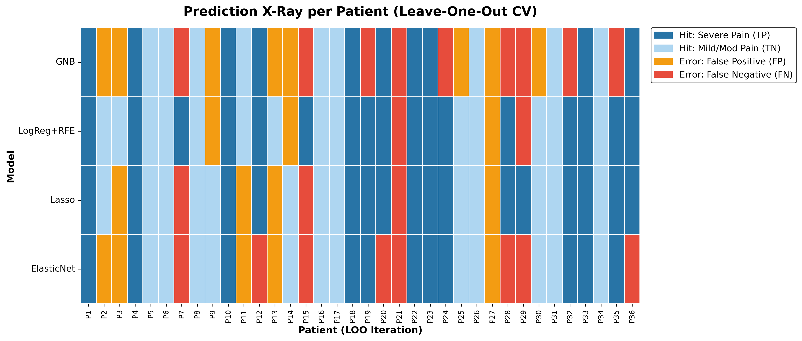

# Neuropathic Chronic Pain Severity Prediction via Resting-State EEG

This repository contains the complete signal processing and Machine Learning pipeline for identifying biomarkers of neuropathic chronic pain using resting-state Electroencephalogram (EEG) data.

The core objective was to cross-reference clinical data from pain questionnaires (**BPI** and **PainDetect**) with brain electrical signals ($N=36$ patients), seeking an objective neurophysiological signature for pain intensity.

---

### Dataset

To run this project, you need to download the clinical and EEG data from the official repository and place it in a local folder.

1. **Download:** [Mendeley Data - Chronic Neuropathic Pain: EEG data](https://data.mendeley.com/datasets/yj52xrfgtz/4)
2. **Setup:** Create a folder named `data` in the root of this repository and extract the files there.

**Reference:**
> M. Zolezzi, Daniela; Naal-Ruiz, Norberto E. ; Alonso Valerdi, Luz María; Ibarra Zárate, Davi Isaac (2023), “Chronic Neuropathic Pain: EEG data in eyes open (5 min) and eyes closed (5 min) with questionnaire reports ”, Mendeley Data, V4, doi: 10.17632/yj52xrfgtz.4

#### Description
The dataset consists of resting-state EEG recordings (5 min Eyes Open, 5 min Eyes Closed) from **36 patients** diagnosed with chronic neuropathic pain (NP). Clinical characterization was performed using **PainDetect** and **BPI** questionnaires.

* **Sample:** 36 patients (mean age 44±13.98).
* **Hardware:** mBrain Train cap (24 Ag/AgCl electrodes), 250 Hz sampling rate.
* **Conditions:** Patients with NP for >3 months, confirmed by clinical history and PainDetect score >12.

## Data and Machine Learning Pipeline

This project’s workflow is structured into five main stages, ranging from raw EEG data cleaning to the training, evaluation, and interpretability of Machine Learning models focused on pain intensity classification.

### 1. EEG Signal Preprocessing (preprocessing.ipynb)
Raw data collected in .gdf format undergoes a rigorous cleaning flow using the MNE-Python library:
- Reading and Inspection: Loading the original 24-channel signals.
- Spatial and Temporal Filtering:
    - Band-pass Filter: 1.0 Hz to 40.0 Hz, maintaining only brain frequencies of interest and removing low-frequency trends.
    - Notch Filter: 60 Hz to eliminate electrical grid interference.
- Re-referencing: Application of the Average EEG reference projection.
- Artifact Removal (ICA): Independent Component Analysis (ICA) with 15 components. The FP1 channel is used as an EOG reference to automatically map and remove components related to ocular noise (e.g., blinks).
- Export: Processed signals are saved in .fif format for subsequent analysis.

### 2. Clinical Data Integration (test_models.ipynb)
To generate training labels, brain signal data is cross-referenced with patient information:
- Demographic and clinical tables (Demographics, BPI, and PainDetect) are merged using the patient ID.
- Target Definition: The dependent variable is extracted from the 'Actual Pain' score, binarizing patients into two groups: Severe Pain (>= 6) and Light/Moderate Pain (< 6).

### 3. Feature Extraction (Biomarkers)
The EEG processing focuses on extracting measures across four frequency bands: Theta (4-8 Hz), Alpha (8-13 Hz), Beta (13-30 Hz), and Gamma (30-40 Hz). The system generates a matrix of 144 features:
- Spectral Power: Calculation of Power Spectral Density (PSD) using Welch’s method.
- Phase-Amplitude Coupling (PAC): Calculation of the Modulation Index (MI) using the Hilbert Transform to investigate interactions between slow and fast frequencies (e.g., Theta-Gamma).
- Hemispheric Asymmetry: Measuring differences in Power and PAC between symmetrical brain regions (e.g., F3-F4). The normalized calculation used is (Right - Left) / (Right + Left).

### 4. Feature Selection and Modeling
Using the biomarker matrix, feature selection techniques and multiple classification algorithms (Scikit-Learn / XGBoost) are applied:
- Feature Selection: Methods such as SelectKBest (Mutual Information), RFE (Recursive Feature Elimination), and Lasso (L1) penalties filter the most determinant biomarkers.
- Trained Models:
    - Gaussian Naive Bayes
    - Logistic Regression (RFE)
    - Logistic Regression (L1/Lasso)
    - Elastic Net

### 5. Evaluation and Statistical Interpretability
Given the medical nature of the data and the sample size, validation prioritizes reducing overfitting and ensuring reliability:
- Nested Cross-Validation: Implementation of a Leave-One-Out (LOO) strategy in the outer loop, combined with GridSearchCV/RandomizedSearchCV in the inner loop for safe hyperparameter optimization.
- Metrics: LOO Accuracy, AUC-ROC, and F1-Score.
- Clinical Interpretation: Ranking feature importance (Lasso weights, RF Importance) to reveal which brain regions and bands most influence pain classification.
- Significance: Execution of Permutation Tests (1000 rounds) to mathematically prove that classification patterns are significant (p-value < 0.05) and not due to chance.

### 6. Results
After running a rigorous Leave-One-Out (LOO) Nested Cross-Validation, the models demonstrated varying degrees of success in differentiating between Severe and Mild/Moderate pain using only the extracted EEG features.

The **Logistic Regression model, coupled with Recursive Feature Elimination (LogReg+RFE)**, significantly outperformed all other approaches. It achieved an accuracy of 86.1% and a remarkable AUC-ROC of 0.935, demonstrating a robust capability to classify pain intensity based on spectral power, phase-amplitude coupling, and hemispheric asymmetry.

The table below summarizes the performance metrics for the tested models:

| Model | Accuracy | AUC-ROC | F1-Score |
| :--- | :---: | :---: | :---: |
| **LogReg + RFE** | **86.1%** | **0.935** | **0.872** |
| Lasso | 80.6% | 0.824 | 0.821 |
| ElasticNet | 63.9% | 0.647 | 0.629 |
| Gaussian Naive Bayes (GNB) | 52.8% | 0.515 | 0.541 |

#### Performance Visualization

The following visual comparisons detail the models' capabilities, highlighting the superiority of the `LogReg+RFE` approach both in terms of raw metrics and ROC curve behavior.



#### Prediction X-Ray (Patient by Patient Analysis)

To understand how each model performed on a granular level, the "Prediction X-Ray" below maps the specific hits and errors across the 36 LOO iterations (one for each patient). This allows us to observe which patients were consistently misclassified across different algorithms (e.g., Patient 21 and Patient 27) and confirm the stability of the `LogReg+RFE` model.



### File Structure

```text
├── data/                   # Directory where the dataset files are stored.
├── tables/                 # Directory for CSV files (Demographics, BPI, PainDetect).
├── cleaned/                # Directory for pre-processed .fif files.
├── images/                 # Directory for graphs and images generated by the code.
├── preprocessing.ipynb     # Cleaning, filtering (1-40Hz), and artifact removal (ICA) of raw EEG signals.
└── test_models.ipynb       # Integration of clinical data, PSD extraction (Eyes Open), and classification pipelines
